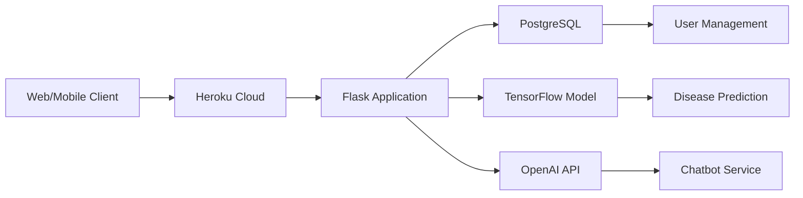

# AgriDoctor: AI-Powered Agricultural Intelligence Platform

[](https://flask.palletsprojects.com/)
[](https://www.tensorflow.org/)
[](https://openai.com/)
[](https://heroku.com)
[](https://opensource.org/licenses/MIT)

## Overview
AgriDoctor is an advanced agricultural intelligence platform that leverages artificial intelligence to transform crop management practices. The platform provides AI-powered plant disease diagnosis through image recognition, a conversational AI assistant for cultivation advice, and a community knowledge-sharing forum. Deployed on Heroku for enterprise-grade reliability and scalability.

## Key Features
- **AI Disease Diagnosis**: Image-based identification of plant diseases with treatment recommendations
- **Intelligent Cultivation Assistant**: GPT-3.5 powered advisory service for agricultural best practices
- **Community Knowledge Hub**: Categorized forums for professional agricultural discourse
- **Cloud Deployment**: Heroku infrastructure with PostgreSQL backend
- **RESTful API**: Integration capabilities for agricultural IoT systems

## Technology Architecture


## Deployment

### Heroku Cloud Installation
```bash
# Clone repository
git clone https://github.com/your-username/agridoctor.git
cd agridoctor

# Authenticate with Heroku
heroku login

# Create application instance
heroku create your-app-name

# Provision PostgreSQL database
heroku addons:create heroku-postgresql:hobby-dev

# Configure environment
heroku config:set OPENAI_API_KEY=your_openai_api_key
heroku config:set SECRET_KEY=your_secret_key

# Deploy application
git push heroku main

# Initialize database schema
heroku run python init_db.py

# Launch application
heroku open
```

### Management Commands
```bash
# Monitor application logs
heroku logs --tail

# Scale web dynos
heroku ps:scale web=1

# Execute database migration
heroku run python manage.py db upgrade

# Run diagnostic check
heroku run python healthcheck.py
```

## Development Environment

### Local Configuration
```bash
# Create virtual environment
python -m venv venv
source venv/bin/activate  # Linux/MacOS
.\venv\Scripts\activate  # Windows

# Install dependencies
pip install -r requirements.txt

# Configure environment variables
echo "OPENAI_API_KEY=your_openai_api_key" > .env
echo "SECRET_KEY=your_secret_key" >> .env
echo "DATABASE_URL=sqlite:///agridoctor.db" >> .env

# Initialize database
python init_db.py

# Start development server
python app.py
```
Access: http://localhost:5000  
**Test Credentials**: admin@agridoctor.com | TemporaryPassword123

## Technical Specifications

### AI Diagnostic Service
```python
# Disease prediction API response
{
  "diagnosis_id": "DG-2024-0720-001",
  "timestamp": "2024-07-20T14:30:00Z",
  "image_hash": "a1b2c3d4e5f67890",
  "prediction": {
    "disease": "Early Blight",
    "confidence": 92.7,
    "crop": "Tomato",
    "treatment_protocol": [
      "Apply copper-based fungicide every 7-10 days",
      "Remove infected plant debris",
      "Implement crop rotation"
    ],
    "prevention_measures": [
      "Maintain proper plant spacing",
      "Avoid overhead irrigation",
      "Apply preventative fungicides"
    ]
  }
}
```

### System Integration
```python
# Example API request to cultivation assistant
import requests

headers = {
    "Authorization": "Bearer YOUR_API_KEY",
    "Content-Type": "application/json"
}

payload = {
    "query": "Optimal irrigation schedule for tomatoes in Mediterranean climate",
    "context": {
        "location": "Southern Spain",
        "soil_type": "sandy loam",
        "growth_stage": "fruiting"
    }
}

response = requests.post(
    "https://api.agridoctor.com/v1/assistant",
    json=payload,
    headers=headers
)

print(response.json())
```
## Contribution Framework

### Development Priorities
1. **AI Model Enhancement**
   - Expand disease detection capabilities
   - Implement model version control
   - Develop accuracy benchmarking suite

2. **Platform Security**
   - OAuth 2.0 implementation
   - API rate limiting
   - Sensitive data encryption

3. **Infrastructure Optimization**
   - Heroku dyno autoscaling
   - Database query optimization
   - Content delivery network integration

### Contribution Process
1. Fork the repository (`github.com/your-username/agridoctor`)
2. Create feature branch (`git checkout -b feature/improvement-name`)
3. Commit changes following Conventional Commits specification
4. Submit pull request with:
   - Technical implementation details
   - Performance metrics
   - Test coverage report

### Code Quality Standards
- Adherence to PEP 8 for Python development
- Minimum 85% test coverage
- Comprehensive API documentation
- Error handling for all external services
- Security vulnerability scanning

## License
This project is licensed under the MIT License - see [LICENSE](LICENSE) for complete terms.

> "Agriculture is the foundation of civilization and any stable economy."  
> - Allan Savory

